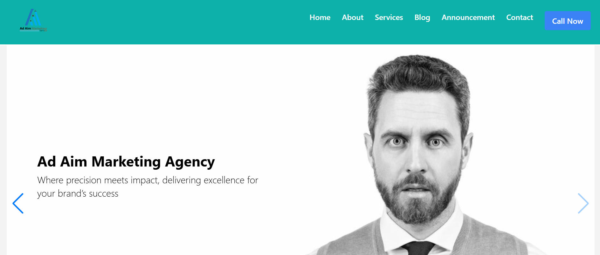

<h1 align="center">Adaim Portfolio</h1>
<a href="#">
  <div align="center">
    
  </div>
</a>

## Features

- Portfolio
- Services
- Blog
- Announcement

## How To Run

```
git clone https://github.com/Itx-Ahmed/Adaim-project-with-Typescript.git
cd Adaim-project-with-Typescript
npm install
npm run dev
```

## Authors

You can get in touch with me on my LinkedIn Profile:

### Muhammad Essa

[](https://www.linkedin.com/in/imuhammadessa)

You can also follow my GitHub Profile to stay updated about my latest projects:

[](https://github.com/imuhammadessa)

### Ahmad Iqbal

LinkedIn: https://www.linkedin.com/in/ahmad-iqbal-/
GitHub: https://github.com/Itx-Ahmed

If you liked the repo then kindly support it by giving it a star ⭐!
